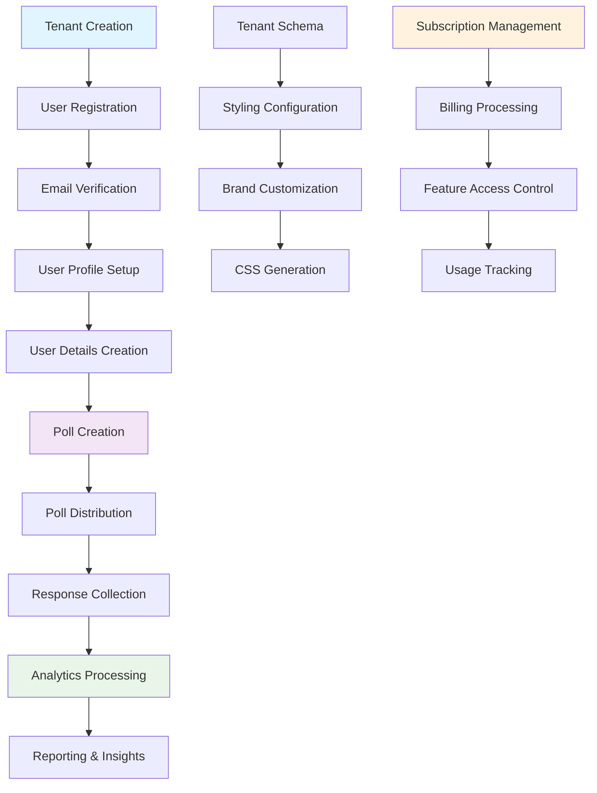
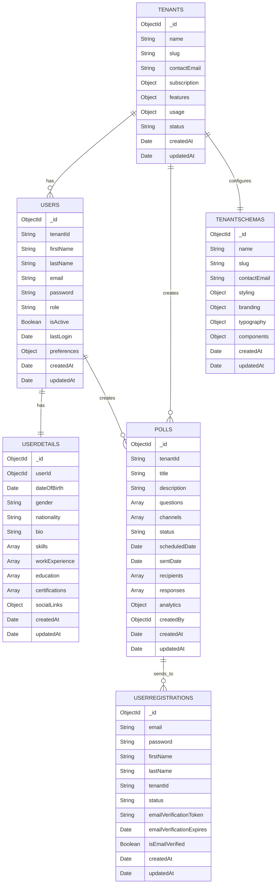
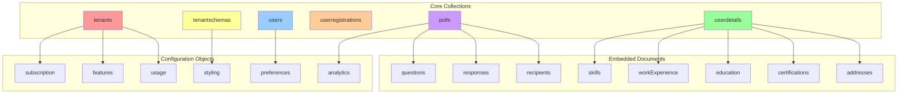
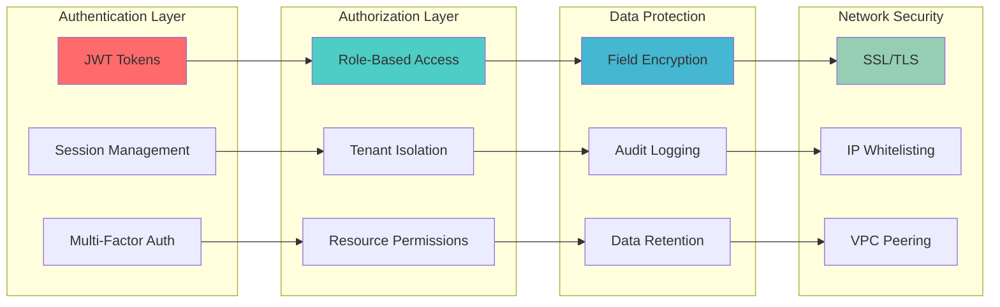
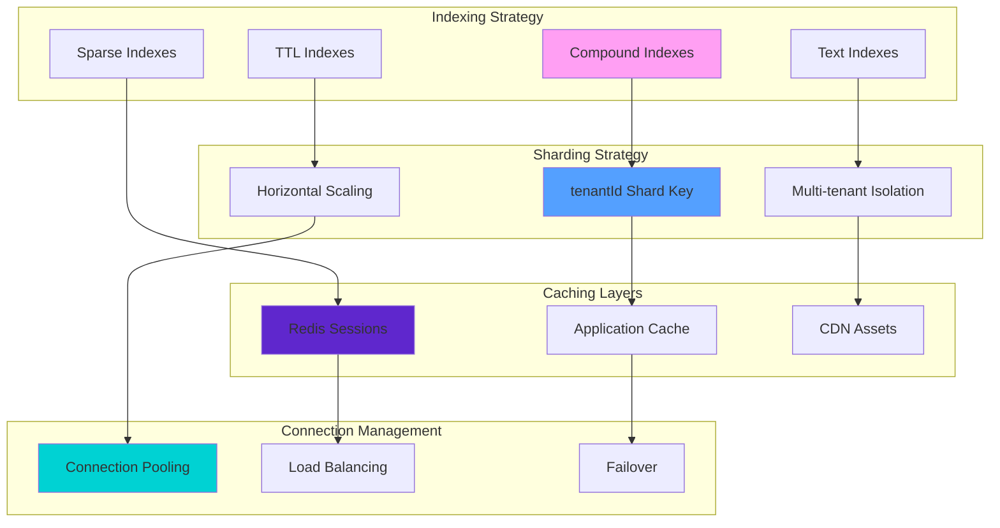
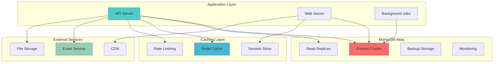
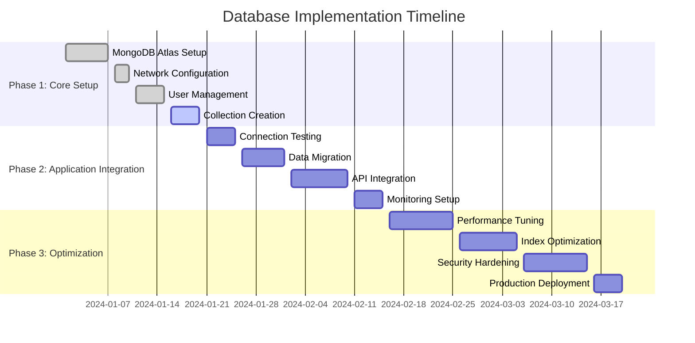
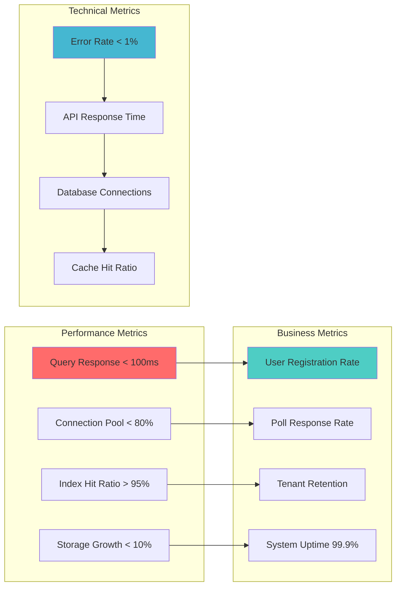

# Trainer Platform - Database Architecture Mindmap

## 🗺️ Database Architecture Overview

```mermaid
mindmap
  root((Trainer Platform<br/>MongoDB Database))
    Collections
      tenants
        Multi-tenant Organizations
        Subscription Management
        Feature Flags
        Usage Statistics
        Billing Integration
      users
        Authentication
        Role Management
        Basic Profile
        Preferences
        Tenant Association
      userdetails
        Extended Profile
        Skills & Experience
        Education & Certifications
        Addresses
        Social Links
      userregistrations
        Registration Process
        Email Verification
        Consent Management
        Tracking & Analytics
      polls
        Poll Creation
        Question Management
        Distribution Channels
        Response Collection
        Analytics & Insights
      tenantschemas
        Styling Configuration
        Branding Settings
        Typography
        Component Theming
    Relationships
      Tenant → Users
        One-to-Many
        tenantId Reference
      User → UserDetails
        One-to-One
        userId Reference
      Tenant → Polls
        One-to-Many
        tenantId Reference
      User → Polls
        One-to-Many
        createdBy Reference
      Poll → Responses
        One-to-Many
        Embedded Documents
      Tenant → TenantSchema
        One-to-One
        slug Reference
    Performance
      Indexing Strategy
        Compound Indexes
        Text Indexes
        TTL Indexes
        Sparse Indexes
      Sharding Strategy
        tenantId Shard Key
        Multi-tenant Isolation
        Horizontal Scaling
      Caching Strategy
        Redis Sessions
        Application Cache
        CDN Assets
    Security
      Authentication
        JWT Tokens
        Session Management
        MFA Support
      Authorization
        RBAC System
        Tenant Isolation
        Resource Permissions
      Data Protection
        Field Encryption
        Audit Logging
        Retention Policies
    Monitoring
      Performance Metrics
        Query Response Time
        Connection Pool Usage
        Index Hit Ratio
      Business Metrics
        User Engagement
        Poll Response Rates
        Tenant Retention
        System Uptime
```

## 🔄 Data Flow Diagram

## 📊 Collection Relationships

## 🏗️ Database Schema Visualization

## 🔐 Security Architecture

## 📈 Performance Optimization

## 🚀 Deployment Architecture

## 📋 Implementation Roadmap

## 🎯 Success Metrics Dashboard

---

## 📝 Key Takeaways

### Database Design Principles:
1. **Multi-tenant Architecture**: Complete tenant isolation using `tenantId`
2. **Scalable Schema**: Flexible document structure for future growth
3. **Performance First**: Strategic indexing and sharding
4. **Security by Design**: Built-in authentication and authorization
5. **Monitoring Ready**: Comprehensive metrics and logging

### Implementation Priorities:
1. **Phase 1**: Core database setup and basic collections
2. **Phase 2**: Application integration and data migration
3. **Phase 3**: Performance optimization and security hardening

### Success Factors:
- Proper indexing strategy
- Multi-tenant isolation
- Comprehensive monitoring
- Security best practices
- Scalable architecture 